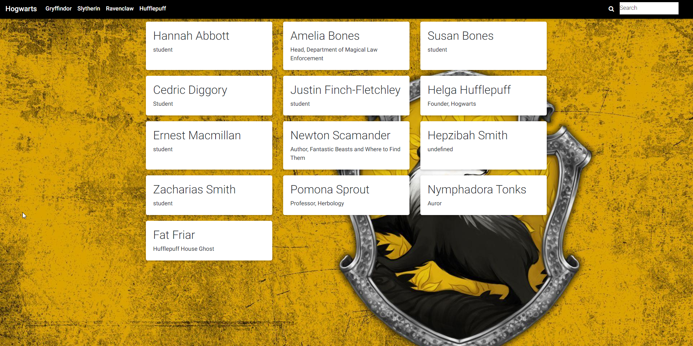

# Wiki Potter
> Trabalho desenvolvido junto com os alunos de INFO III sobre consumo de APIS

Estamos consumindo a API publica: https://www.potterapi.com/




## Installation

Web:

```sh
Acesse: www.wikipotter.com (ficticio)
```

## Exemplo de uso

Informações sobre personagens do Harry Potter


## Setup de desenvolvimento


```sh
Abra  no Visual Studio Code e rode com a extensão live reload
```

## Release History

* 0.0.1
    * The first proper release
    * Work in progress

## Meta

Zanchet Luan – [@zanchetluan](https://twitter.com/zanchetluan) – luuanzanchet@outlook.com


[https://github.com/LuanZanchet/wikipotter](https://github.com/LuanZanchet)

## Contributing

1. Fork it (<https://github.com/LuanZanchet/wikipotter/fork>)
2. Create your feature branch (`git checkout -b feature/fooBar`)
3. Commit your changes (`git commit -am 'Add some fooBar'`)
4. Push to the branch (`git push origin feature/fooBar`)
5. Create a new Pull Request

<!-- Markdown link & img dfn's -->
[npm-image]: https://img.shields.io/npm/v/datadog-metrics.svg?style=flat-square
[npm-url]: https://npmjs.org/package/datadog-metrics
[npm-downloads]: https://img.shields.io/npm/dm/datadog-metrics.svg?style=flat-square
[travis-image]: https://img.shields.io/travis/dbader/node-datadog-metrics/master.svg?style=flat-square
[travis-url]: https://travis-ci.org/dbader/node-datadog-metrics
[wiki]: https://github.com/yourname/yourproject/wiki
